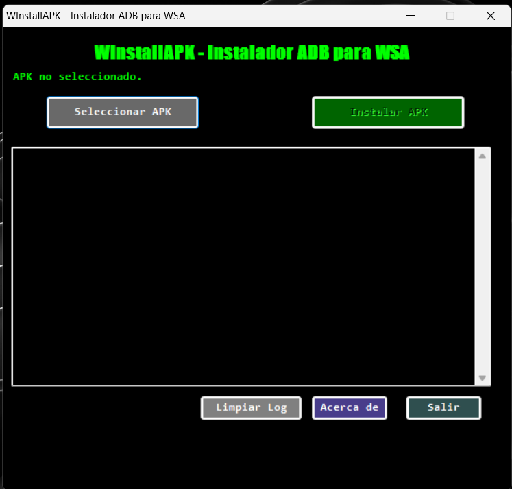
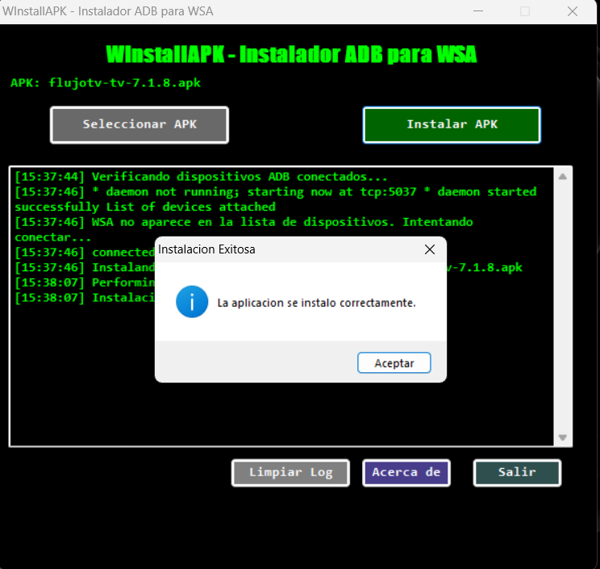

# WInstallAPK

**Versión:** 1.0.0  
**Autor:** Rodolfo Álvarez  

---

## 🧩 Descripción

**WInstallAPK** es una herramienta gráfica desarrollada en **PowerShell** que permite instalar archivos **APK** fácilmente en el **Subsistema de Windows para Android (WSA)**. Pensada para quienes prefieren una experiencia visual y cómoda, sin tener que escribir comandos en la terminal.

Este instalador automatiza la conexión con **ADB**, permite instalar apps con un solo clic y ofrece una interfaz retro en modo oscuro que recuerda a las clásicas consolas verdes sobre negro.

---

## ⭐ Características principales

- 📲 Instalación directa de APKs en WSA con un solo clic.
- 🔌 Conexión automática a ADB utilizando el puerto estándar de WSA (`127.0.0.1:58526`).
- 🧾 Registro detallado del proceso de instalación, visible en tiempo real.
- 🖥️ Interfaz gráfica retro estilo consola (modo oscuro verde/negro).
- 🧹 Botón para limpiar logs, salir del programa y ver la sección "Acerca de".
- 🪟 Compatible con **Windows 10** y **Windows 11** con soporte para WSA.
- ⚙️ No requiere instalación externa de ADB (usa archivos locales incluidos).

---

## 📦 Requisitos

Para que WInstallAPK funcione correctamente necesitas:

- Tener activado **WSA (Windows Subsystem for Android)** en tu PC.
- Activar la opción de **depuración por ADB** dentro de la configuración de WSA.
- Incluir los siguientes archivos de ADB en la misma carpeta que el script:
  - `adb.exe`
  - `AdbWinApi.dll`
  - `AdbWinUsbApi.dll`
- Sistema operativo: **Windows 10** o **Windows 11**

> ⚠️ Importante: Si no tienes activado WSA, esta herramienta no funcionará.
Aunque Microsoft ha eliminado el acceso oficial a WSA y WSATools, aún puedes instalar WSA manualmente con versiones actualizadas gracias a la comunidad.
Puedes obtener builds de WSA desde este repositorio comunitario:
👉 https://github.com/MustardChef/WSABuilds

---

## 🚀 Instalación y uso

1. Clona o descarga este repositorio desde GitHub.
2. Copia los archivos de ADB a la misma carpeta donde está `WInstallAPK.ps1`.
3. Ejecuta el script `WInstallAPK.ps1` con permisos de PowerShell.
4. Haz clic en “Seleccionar APK”, elige tu archivo y luego presiona **"Instalar APK"**.
5. ¡Listo! El proceso se muestra en pantalla y te avisará cuando haya finalizado.

---

## 🖼️ Capturas de pantalla

---

## 🔗 Enlaces importantes

- 📂 Repositorio GitHub:  
  [https://github.com/iscrodolfoalvarez](https://github.com/iscrodolfoalvarez)

- 📺 Canal de YouTube (Tutoriales y novedades):  
  [https://youtube.com/@iscrodolfoalvarez](https://youtube.com/@iscrodolfoalvarez)

---

## ☕ Apóyame con un café

Si esta herramienta te fue útil y quieres contribuir al desarrollo futuro, puedes invitarme un café ☕. ¡Gracias por apoyar proyectos open source!

👉 **[Donar vía PayPal](https://www.paypal.com/paypalme/rodolfoalvarez90)**

---

## ❤️ Agradecimientos

Gracias por usar **WInstallAPK**. ¡Espero que te facilite la vida al instalar tus apps en WSA!  
Si tienes ideas, mejoras o encuentras errores, no dudes en crear un _issue_ en el repositorio o dejar un comentario en el canal de YouTube.
